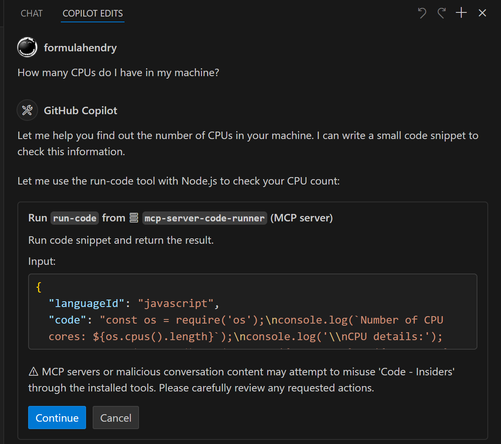
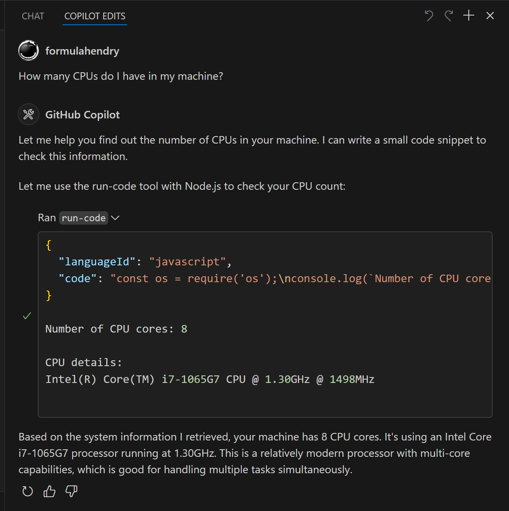

# Code Runner MCP Server
[](https://www.npmjs.com/package/mcp-server-code-runner) [](https://smithery.ai/server/@formulahendry/mcp-server-code-runner)

MCP Server for running code snippet and show the result.

It supports running multiple programming languages: **JavaScript, PHP, Python, Perl, Perl 6, Ruby, Go, Lua, Groovy, PowerShell, BAT/CMD, BASH/SH, F# Script, C# Script, VBScript, TypeScript, CoffeeScript, Scala, Swift, Julia, Crystal, OCaml Script, R, AppleScript, Elixir, Clojure, Racket, Scheme, AutoHotkey, AutoIt, Kotlin Script, Dart, Haskell, Ni, Lisp, Kit, V, SCSS, Sass**. Full list could be seen here in [constants.ts](https://github.com/formulahendry/mcp-server-code-runner/blob/main/src/constants.ts).

<a href="https://glama.ai/mcp/servers/d3mluq4vy9">
  
</a>

## Setup

### VS Code

Configuration in `settings.json`:

```json
{
  "mcp": {
    "inputs": [],
    "servers": {
      "mcp-server-code-runner": {
        "command": "npx",
        "args": [
          "-y",
          "mcp-server-code-runner"
        ],
      }
    }
  }
}
```

### Claude Desktop

Configuration in `claude_desktop_config.json`: 

```json
{
  "mcpServers": {
    "mcp-server-code-runner": {
      "command": "npx",
      "args": [
        "-y",
        "mcp-server-code-runner"
      ],
    }
  }
}
```

### Installing via Smithery

> **_NOTE:_**  This will run Code Runner MCP Server in a remote Container environment hosted by Smithery.

To install Code Runner MCP Server for Claude Desktop automatically via [Smithery](https://smithery.ai/server/@formulahendry/mcp-server-code-runner):

```bash
npx -y @smithery/cli install @formulahendry/mcp-server-code-runner --client claude
```

### npx issue on Widnows

On Windows, [MCP servers may fail to connect with `npx`](https://github.com/modelcontextprotocol/servers/issues/40).

You could try below two workarounds:

#### use bunx

1. Install [Bun](https://bun.sh/docs/installation).
2. In configuration, change `npx` with `bunx`.

#### use cmd

Below is VS Code configuration in `settings.json`:

```json
{
  "mcp": {
    "inputs": [],
    "servers": {
      "mcp-server-code-runner": {
        "command": "cmd",
        "args": [
          "/c",
          "npx",
          "-y",
          "mcp-server-code-runner"
        ],
      }
    }
  }
}
```

## Usage

Before using Code Runner MCP Server, please make sure interpreter or compiler of the programming language you want to run is set in `PATH` environment variable.

Try below prompts in the application which has configured Code Runner MCP Server:

* `Run the JavaScript Code: console.log(5+6)`
* `Where is temporary folder in my OS? Use run-code tool`
* `How many CPUs do I have in my machine? Use run-code tool`





## Build your own MCP Server

Want to build your own MCP Server? Try [Yeoman Generator for MCP Server](https://www.npmjs.com/package/generator-mcp) to create your MCP Server project!
